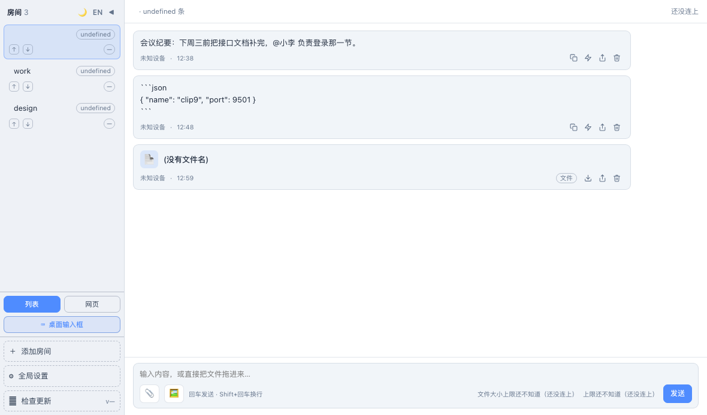
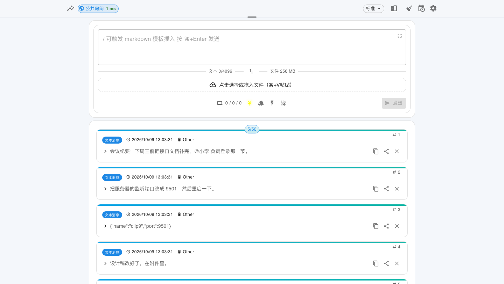
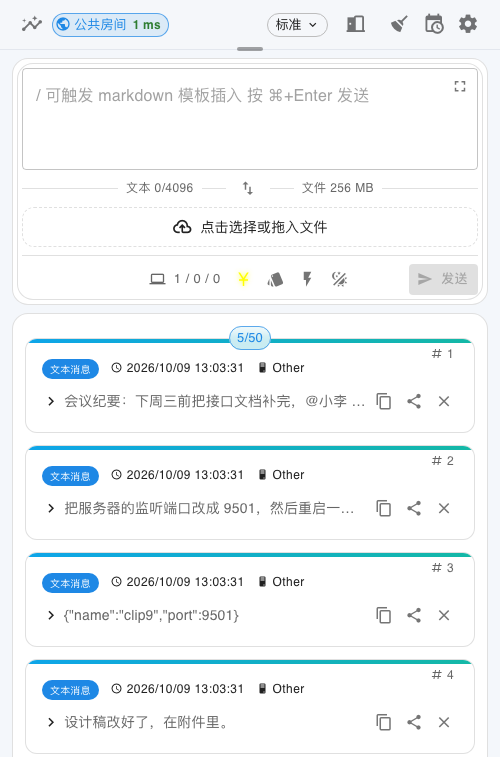

<h1 align="center"> clip9 </h1>

<p align="center">
  <a href="https://github.com/Jonnyan404/clip9/releases/latest">
    
  </a>
  <a href="https://github.com/Jonnyan404/clip9/releases">
    
  </a>
  <a href="./LICENSE"></a>
  
  
</p>

<p align="center">
  <strong>自托管的跨设备剪贴板 —— 文本、图片、文件在手机、电脑、路由器之间实时互传。</strong><br>
  Rust 重写自 <a href="https://github.com/Jonnyan404/cloud-clipboard-go">cloud-clipboard-go</a>，数据完全握在自己手里。
</p>

---

## 📸 界面截图

<details>
<summary><b>💻 桌面端</b></summary>



</details>

<details>
<summary><b>🌐 网页端</b></summary>



</details>

<details>
<summary><b>📱 手机</b></summary>



</details>

---

## 🎯 亮点

| 特性 | 说明 |
|---|---|
| 🔒 **隐私安全** | 部署在自己的机器或服务器上，数据不经过任何第三方 |
| 📦 **部署灵活** | 一个静态二进制同时供应 Docker、裸机、OpenWrt 与 Android；另有 Cloudflare Serverless 一路 |
| 🌍 **跨平台** | 服务端覆盖 Linux / macOS / Windows / ARM 路由；客户端有桌面端、Android 与快捷指令 |
| ⚡ **实时同步** | WebSocket 双向广播，历史走 HTTP 分页拉取（只推实时、不推全量） |
| 🔐 **认证保护** | 全局密码、按房间独立密码、可续期的会话令牌、带密码的分享链接 |
| 🎨 **多种界面模式** | 时间流 / 速览 / 便签 / 看板等；`?mode=` 让同一个浏览器标签页锁定一种模式 |
| 🧩 **动作库** | 一条内容换个方式看：Markdown、JSON 美化、编解码、注音、日期计算、哈希…… 还能串成流水线 |
| ⏰ **定时自动化** | 按每天 / 每周 / 仅一次 / 5 字段 cron 把渲染好的文本投进房间，正文支持模板变量 |
| 🔗 **分享链接** | 单条内容的短期链接，可限次数、可带密码，分享页自动注入 OG 卡片 |
| 🪶 **轻量** | 内存与体积都很小，16 MB flash 的路由器也能跑 |

---

## 🚀 快速开始

> 服务端默认监听 **9501**。装好之后浏览器打开 `http://<服务器地址>:9501` 就是界面。

### 🐳 Docker（推荐）

```bash
docker run -d \
  --name clip9 \
  --init \
  -p 9501:9501 \
  -v /path/to/data:/app/server-node/data \
  ghcr.io/jonnyan404/clip9:latest
```

> ⚠️ **`--init` 是必须的**：服务端没有装 SIGTERM 处理器，而 PID 1 对没有处理函数的信号是内核直接忽略的。
> 不加它，`docker stop` 要等满 10 秒超时才被 SIGKILL；加上之后实测 **0.22 秒**。
>
> ⚠️ `latest` **只在正式发布时才有**；预发布只推 `vX.Y.Z`，要用 beta 就写全版本号。

<details open>
<summary><b>docker-compose.yml</b></summary>

仓库根目录自带一份，写法与 Go 版一致：

```yaml
services:
  clip9:
    container_name: clip9
    restart: always
    init: true
    ports:
      - "9501:9501"
    environment:
      LISTEN_PORT: ${LISTEN_PORT:-}            # 监听端口，默认 9501
      AUTH_PASSWORD: ${AUTH_PASSWORD:-}        # 全局访问密码，留空即无需密码
      ROOM_AUTH_JSON: '${ROOM_AUTH_JSON:-{}}'  # 房间密码 JSON，如 {"finance":"finance-pass"}
      MESSAGE_NUM: ${MESSAGE_NUM:-}            # 历史保留条数，默认 50
      TEXT_LIMIT: ${TEXT_LIMIT:-}              # 文本长度上限（字节），默认 4096
      FILE_EXPIRE: ${FILE_EXPIRE:-}            # 文件过期秒数，默认 3600
      FILE_LIMIT: ${FILE_LIMIT:-}              # 文件大小上限（字节），默认 104857600
      MKCERT_DOMAIN_OR_IP: ${MKCERT_DOMAIN_OR_IP:-}  # 填域名/IP 即自动签发自签证书
    volumes:
      - /path/your/dir/data:/app/server-node/data  # 改成你自己的目录
    image: ghcr.io/jonnyan404/clip9:latest
```

```bash
docker compose up -d
```

</details>

### 📦 其他装法

<details>
<summary><b>1️⃣ 独立二进制（Linux / macOS / Windows）</b></summary>

从 [Releases](https://github.com/Jonnyan404/clip9/releases) 下载对应平台的文件：

```bash
./clip9-cli -port 9501 -auth mypassword123
```

常用参数：`-host` / `-port` / `-auth` / `-config` / `-static`，全部见 `--help`。
</details>

<details>
<summary><b>2️⃣ OpenWrt 路由器</b></summary>

```bash
cat /etc/apk/arch                                  # 先看架构

apk add --allow-untrusted ./clip9-<版本>-<架构>.apk   # OpenWrt 25.12+
opkg install ./clip9_<版本>_<架构>.ipk                # OpenWrt 24.10 及更早
```

装完在 LuCI 里配置。
</details>

<details>
<summary><b>3️⃣ Android 手机当服务器</b></summary>

从 [Releases](https://github.com/Jonnyan404/clip9/releases) 装 `.apk`，打开后设端口/密码、点「启动服务」，
局域网里任何设备访问 `http://手机IP:9501` 即可。
</details>

<details>
<summary><b>4️⃣ Cloudflare Workers（Serverless）</b></summary>

基于 Workers + D1 + R2，支持 GitHub Actions 自动部署或本地脚本部署。
详见 [Cloudflare 部署指南](./cloudflare/README.md)。
</details>

<details>
<summary><b>5️⃣ 从源码构建</b></summary>

> 前置：Node.js ≥ 22、Rust stable。

```bash
cd web && npm install && npm run build    # 前端产物
node tools/sync-web-assets.mjs            # 同步进 rust/crates/server/static/（会被编进二进制）
cd rust && cargo build --release -p clip9-server
```

⚠️ **`cargo` 只能在 `rust/` 里跑** —— 仓库根没有 `Cargo.toml`。
</details>

---

## ⚙️ 配置

服务端读一个 JSON 配置文件（默认 `config.json`，不存在时**自动生成一份默认的**）。Docker 与 OpenWrt 下由入口脚本生成。

<details>
<summary><b>配置字段一览</b></summary>

```json
{
  "server": {
    "host": ["0.0.0.0"], "port": 9501, "prefix": "",
    "history": 50, "dbPath": "clip9.redb", "storageDir": "uploads",
    "auth": false, "roomAuth": {}, "cert": "", "key": "",
    "roomList": false, "roomCleanup": 3600
  },
  "text": { "limit": 4096 },
  "file": { "expire": 3600, "chunk": 1048576, "limit": 268435456 },
  "automation": { "enabled": true, "tickSeconds": 30, "graceSeconds": 600, "defaultTZ": "Asia/Shanghai" }
}
```

</details>

> ℹ️ 环境变量名与命令行参数名都与 Go 版**逐一对齐**，换过来通常只需要改 Docker 的 `image` 那一行。

**从 Go 版迁移数据**：把旧的 `data/` 目录指给 `-config`，首次启动会自动导入历史与文件。

---

## 🌐 API

- **规格**（Redoc，可切中英）：[jonnyan404.github.io/clip9/spec.html](https://jonnyan404.github.io/clip9/spec.html)
- **英文原文**：[`docs/openapi/clip9.openapi.yaml`](./docs/openapi/clip9.openapi.yaml)（OpenAPI 3.1，32 条路径）
- **中文规格**：[`docs/openapi/clip9.openapi.zh.yaml`](./docs/openapi/clip9.openapi.zh.yaml) —— **生成物**，
  由 [`zh.yaml`](./docs/openapi/zh.yaml) 译文表 + 英文原文拼出；未译到的条目保留英文。

```bash
curl http://localhost:9501/content/latest          # 最新一条
curl "http://localhost:9501/content?room=work"     # 某个房间的历史
```

---

## 🗂️ 项目结构

<details>
<summary><b>展开</b></summary>

| 目录 | 是什么 |
|---|---|
| `rust/crates/server` | HTTP + WebSocket 服务端（前端产物编在里面） |
| `rust/crates/client` | 连接与同步逻辑（桌面端与 SPA 共用一份契约） |
| `rust/crates/core` | 纯逻辑：配置、动作库、统计、协议类型 |
| `rust/crates/store` | 存储（redb） |
| `rust/crates/desktop` | Tauri 桌面端 |
| `web/` | 网页界面（React + Vite） |
| `android/` | Android 外壳（Kotlin） |
| `cloudflare/` | Workers + D1 + R2 那一路 |
| `openwrt/` | 路由器打包与 LuCI 插件 |
| `shortcuts/` | Apple / Android 快捷指令 |

</details>

---

## 🤝 贡献

欢迎 Issue 与 PR。提交前请跑门禁（**零警告是硬要求**）：

```bash
cd rust
cargo fmt --all
cargo clippy --workspace --all-targets -- -D warnings
cargo test  --workspace
```

> ℹ️ 仓库里有一份内部的工程约定与设计稿（`dev-docs/`），它**刻意不入库** —— 里面混着工作过程记录。
> 所以代码注释里会看到 `见 dev-docs/…` 这类指针，对只拿到仓库的人来说那些指向的是不存在的东西，
> 这是**有意的取舍**。

---

## 📄 许可证与致谢

基于 [MIT License](./LICENSE) 开源。

前端与后端最初 fork 自 [TransparentLC/cloud-clipboard](https://github.com/TransparentLC/cloud-clipboard)
与 [yurenchen000/cloud-clipboard](https://github.com/yurenchen000/cloud-clipboard)，
以及它的 Go 前身 [Jonnyan404/cloud-clipboard-go](https://github.com/Jonnyan404/cloud-clipboard-go)。

---

## ☕ 支持项目

如果这个项目帮到了你，欢迎 ⭐ Star，或通过以下方式支持我们：

### 💰 赞赏捐助

你的支持是我们继续维护和改进项目的动力！

| 方式 | 二维码 |
|------|--------|
| **微信** |  |


### 🌟 其他支持方式

- [【腾讯云】2核2G云服务器新老同享 99元/年，续费同价](https://cloud.tencent.com/act/cps/redirect?redirect=6150&cps_key=0b1dfaf9bb573dac05abef76202dc8cc&from=console)
- [【阿里云】2核2G云服务器新老同享 99元/年，续费同价](https://www.aliyun.com/daily-act/ecs/activity_selection?userCode=79h2wrag)
